<!-- $theme: default-->
<!-- $size: 16:9 -->

# Quantitative assessment of research data management practice - University of Bordeaux
## Contexte, méthode et focus sur quelques résultats

 

S.O. MATE - Rencontres d'hiver
22 novembre 2019

 

<small>

*Frédérique Flamerie* 
*chargée de mission science ouverte/données de recherche*
*Université de Bordeaux - Direction de la documentation*

</small>

 

<!-- *footer: Date de dernière mise à jour : 2020-01-17 -->

---
# Préambule - Les données de recherche, des objets documentaires?

:mag: Utiliser des **entrepôts de données** pour trouver et/ou déposer des données - ex : [Zenodo](https://zenodo.org/), [Dryad](https://datadryad.org/), [Harvard Dataverse](https://dataverse.harvard.edu/), [4TU.ResearchData](https://researchdata.4tu.nl/en/)

:card_index: **Documenter** les données : documentation structurée et/ou documentation informelle minimale en utilisant le plus possible des outils standardisés (formats de métadonnées, vocabulaires contrôlés, etc.) 

:page_facing_up: **Citer** des données

 
:information_source: Prendre en compte ces éléments dans un **DMP - data management plan**

:+1: Prendre en compte ces éléments pour augmenter le caractère **FAIR** des données

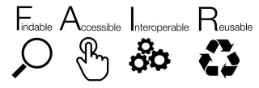

---

# Préambule - Les données de recherche, des objets documentaires? 
 
:writing_hand: **2018** Journée d'ateliers pratiques [Des outils pratiques pour gérer et valoriser vos données de recherche - doi: 10.5281/zenodo.1256734](https://doi.org/10.5281/zenodo.1256734) co-organisée par l'Université Bordeaux Montaigne, l'université de Bordeaux et l'Urfist de Bordeaux

:writing_hand: **2018** Formation Urfist de Bordeaux - 4h : [Organiser efficacement ses données](https://github.com/fflamerie/organisation_donnees_2018) - retour en **2020**

:soon: 

:writing_hand: **2019-2020** Atelier des BU 1h ouvert à tous : [Zenodo, Figshare, etc. : rechercher et partager des données de recherche grâce aux entrepôts de données](https://github.com/fflamerie/atBU_entrepots_donnees)

:writing_hand: **2020** Module transverse au catalogue du Collège des écoles doctorales - 3h : « _Data sharing_ : trouver, réutiliser et citer des données de recherche  »

---
# 1. Contexte

Encore une enquête...

<!-- footer: 1. Contexte / 2. Méthode / 3. Focus sur quelques résultats-->

---
# 1. Objectifs

* Sensibiliser à des aspects parfois méconnus liés aux données de recherche (DMP, FAIR, entrepôts de données, etc.)
* Mieux connaître les attentes et les pratiques de notre communauté

Le choix d'un instrument d'enquête existant visait à inscrire cette démarche dans le cadre plus large d'un projet international, afin de produire des données compatibles avec des jeux de données existants, et partant de faciliter leur réutilisation. Ce choix visait aussi à bénéficier du travail de conception d'enquête effectué par des institutions à l'expertise et l'expérience reconnues.

---
# 1. Périmètre

L'enquête avait un périmètre très large, du point de vue tant de son objet que de son audience.

**Objet** : les données de recherche sont entendues au sens large, et englobent toutes les données collectées, générées ou étudiées dans le cadre des activités de recherche, et à des fins de recherche, _i. e._ pour produire, documenter et valider la recherche.

**Audience** : la communauté scientifique au sens large de l'université de Bordeaux était invitée à contribuer. Les réponses des doctorants, chercheurs ou encore personnel support étaient attendues.

---

# 2. Etapes en amont - 2018-11

:question: choix des questions : les 10 questions communes + les questions spécifiques à l'EPFL concernant les services utiles pour la gestion des données et les pratiques de partage des données associées aux publications

:pencil: saisie dans Sphinx

:gb: :arrow_right: :fr: traduction des questions et des réponses : outil de traduction intégré à Sphinx, DeepL, corrections manuelles

:handshake::phone: visioconférence avec les collègues de l'EPFL

:ballot_box_with_check: test du questionnaire : pertinence des traductions et ergonomie du formulaire

:loudspeaker: rédaction des textes d'accompagnement : courriels, actualité pour le site web

---

# 2. Diffusion du questionnaire - du 4 au 28 janvier 2019

:hourglass_flowing_sand:
:hourglass_flowing_sand:
:hourglass_flowing_sand:

Un message initial et un message de relance ont été adressés aux **5959** destinataires des 11 listes de diffusion des nouveaux départements de recherche de l'université de Bordeaux. **425** personnes ont répondu, ce qui permet d'estimer un taux de retour supérieur à **7%**, le périmètre des listes de diffusion excédant celui du public cible de l'enquête.

---

# 2. Etapes en aval 1/2 - 2019-01 à 2019-06
:outbox_tray: export des données de réponse de Sphinx

:gear: 1ère phase de traitement des données dans Excel : restitution du nom de département à partir de l'unité de recherche si applicable, codage des verbatim

:chart_with_downwards_trend: création des visualisations dans Datawrapper

:page_with_curl: rédaction et diffusion des synthèses v1 : version brève pour les répondants intéressés par les résultats et ayant renseigné leur adresse de messagerie / version longue

:bookmark_tabs: préparation du dépôt dans Zenodo : choix des champs à retirer, mise en forme des questionnaires :fr: et :gb: en format texte, préparation du codebook et du readme

---

# 2. Etapes en aval 2/2 - 2019-01 à 2019-06

:handshake: rencontre avec les collègues de Delft

:gear:  2ème phase de traitement des données dans Excel et OpenRefine :  suppression des champs à retirer, anonymisation des verbatim conservés, remplacement des modalités de réponse en français par les modalités en anglais

:inbox_tray: dépôt du jeu de données dans Zenodo, sous licence Creative Commons Zero - https://doi.org/10.5281/zenodo.3241238

:chart_with_downwards_trend: comparaison des résultats avec ceux de Delft, Cambridge et l'EPFL et création de visualisations pour ces comparaisons 

:page_with_curl: rédaction et diffusion d'une synthèse longue v2, incluant des éléments de comparaison avec les résultats de Delft, Cambridge et l'EPFL

---

# 3. Focus sur quelques résultats

_Note concernant les données utilisées pour les comparaisons Delft/Cambridge/EPFL_

Les données datent de fin 2017 ; deux jeux de données ont été utilisés.

* Le jeu de données agrégeant les données de réponse aux questions communes pour les 3 établissements, mis à disposition dans l’espace Open Science Framework du projet : https://osf.io/mz3fx/ - fichier EPFL_TUDelft_UCam_general_data_together.xlsx
* Le jeu de données agrégeant les données de TU Delft et de l’EPFL pour la question spécifique à l’EPFL et l’Université de Bordeaux concernant le partage de fichiers de données associés aux publications, mis à disposition sur Zenodo : https://doi.org/10.5281/zenodo.2613680

Pour TU Delft, les données concernent ainsi 3 des 8 facultés : Faculty of Electrical Engineering, Mathematics and Computer Science, Faculty of Civil Engineering and Geosciences and Faculty of Aerospace Engineering.

---

# 3. Qui a répondu à l'enquête à Bordeaux?

Plutôt des enseignants et des enseignants-chercheurs... 

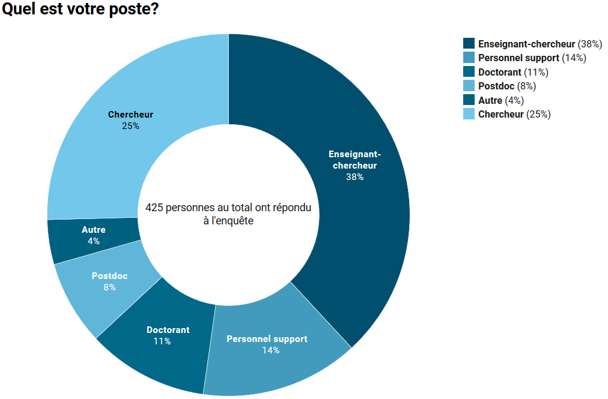

---
# 3. Qui a répondu à l'enquête à Bordeaux?

...plutôt des domaines sciences, techniques et médecine.

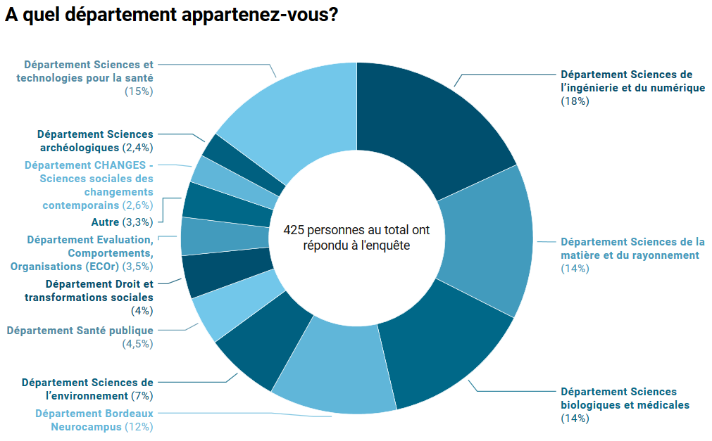

---

# 3. Quatre grandes rubriques pour analyser les résultats
## 3.1 Pratiques et habitudes de gestion de données
Sauvegarde, perte de données, difficulté à retrouver des données, outil de gestion de données, responsabilité de la gestion des données.
## 3.2 Connaissances générales
DMP, FAIR, propriété des données
## 3.3 Connaissances et pratiques en termes de partage des données
Entrepôts de données, partage de fichiers de données associés aux publications
## 3.4 Attentes en termes de formations et de services

---
 
# 3.1 En cas de perte de données, quantité de temps perdu

 = l'une des différences les plus notables entre l'UB et les autres établissements 
 

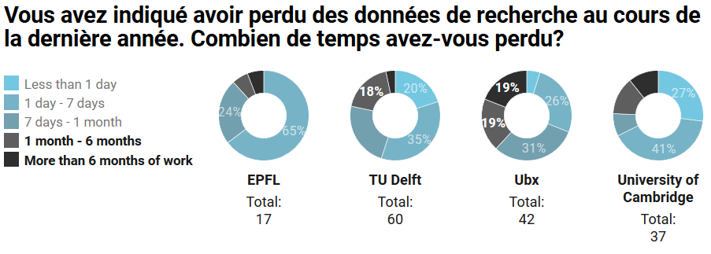

---

# 3.1 Utilisation d'outils de gestion de données

 = l'une des différences les plus notables entre l'UB et les autres établissements 

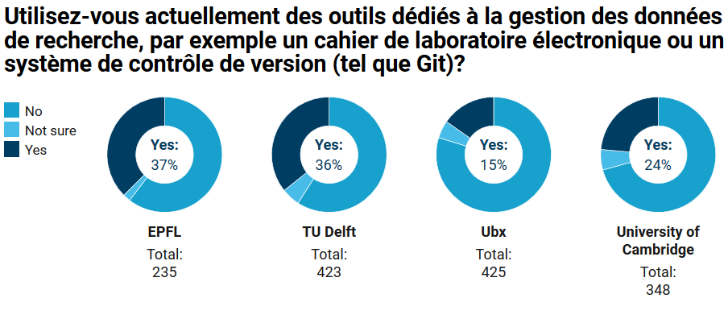

A l'UB, presque **60%** de ceux qui ne sont pas sûrs ou n'utilisent pas d'outils de gestion de données dédiés sont intéressés pour en essayer.

---

# 3.1 Responsabilité de la gestion des données

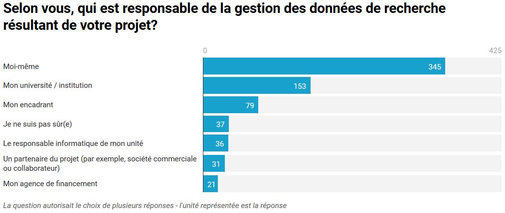

A l'UB, la **responsabilité** de la gestion des données est envisagée individuellement par 43% des répondants, qui ont choisi pour unique modalité de réponse "Moi-même".

---

# 3.2 Connaissances générales : FAIR
 = l'une des différences les plus notables entre l'UB et les autres établissements 

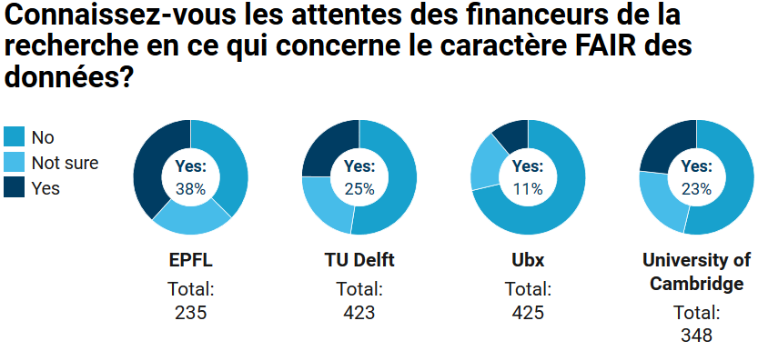

---

# 3.2 Connaissances générales :  DMP
 = l'une des différences les plus notables entre l'UB et les autres établissements 

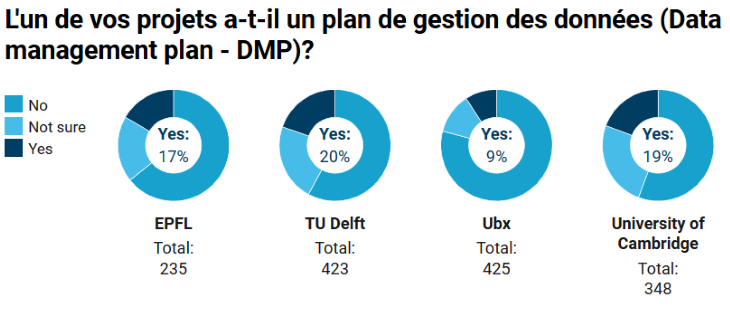

---

# 3.2 Connaissances générales : propriété des données
A l'UB,  **47%** des répondants indiquent savoir à qui appartiennent les données qu'ils créent.

:point_right: La quasi-totalité des réponses (176 sur 194) à la question suivante "Vous avez indiqué que vous savez à qui appartiennent les données de recherche que vous créez. A qui appartiennent-elles?" mentionne, à des échelles diverses de l'unité de recherche à l'Etat, **l'institution** comme au moins l'un des propriétaires des données. 
"Moi-même" ou ses équivalents est indiqué dans seulement 26 réponses, et comme unique modalité de réponse de façon très marginale (5 occurrences).

---

# 3.3  Les entrepôts de données

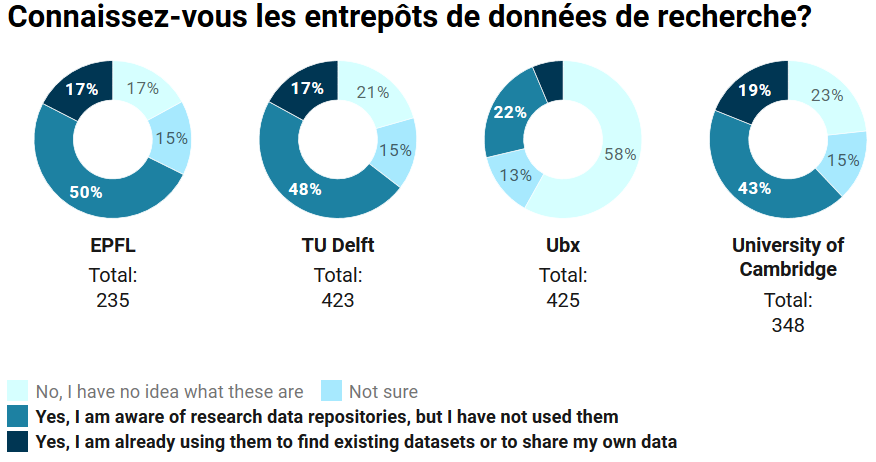

Delft et Cambridge disposent d'un entrepôt propre, il s'agit respectivement de [4TU.Centre for Research Data](https://researchdata.4tu.nl/en/), entrepôt de données inter-institutionnel, et d'[Apollo](https://www.repository.cam.ac.uk/), archive ouverte pour les publications acceptant aussi les données. 

---

# 3.3 Partage de fichiers de données associés aux publications

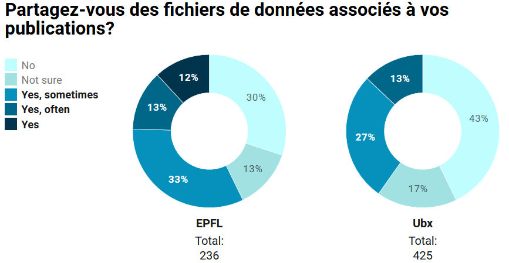

---
# 3.3 Partage de fichiers de données associés aux publications

A l'UB, parmi les 147 répondants qui ont détaillé le mode de partage des données, les **moyens informels** sont globalement privilégiés. 30 réponses n'ont pas été codées, en raison de la difficulté ou de l'impossibilité d'interprétation de la réponse. 

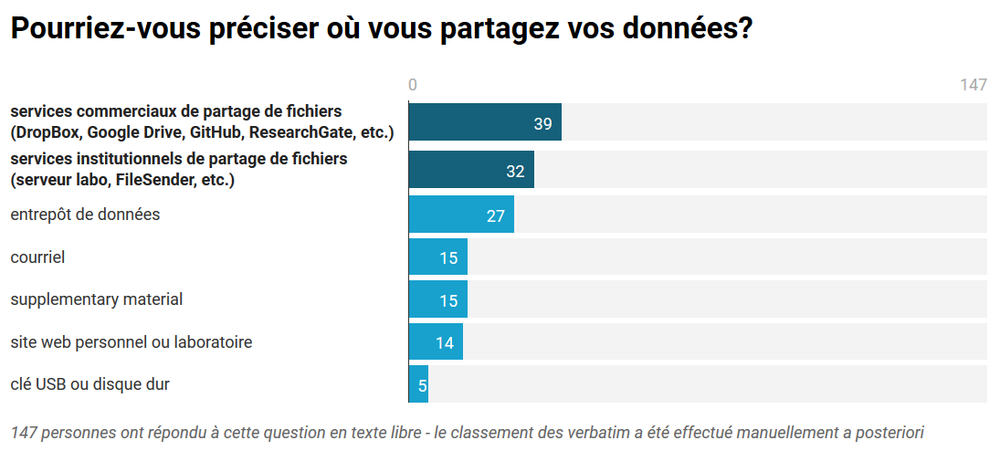

---

# 3.4 Attentes en termes de formations et de services 1/3

## Priorité 1 : aspects informatiques
Notamment en termes de stockage et de sauvegarde.

:raised_hands: Un service de **"Conseils pour les questions de stockage et de sécurité"** arrive en tête des services mentionnés comme utiles.

## 2 : éléments transversaux

Notamment lorsque l'on y intègre le **DMP**, qui a vocation à couvrir tout le spectre de la gestion des données. 

:writing_hand: Une formation d'**"Introduction générale à la gestion des données de recherche"** intéresserait 47,8% des répondants.

---

# 3.4 Attentes en termes de formations et de services 2/3

## 3 : domaine documentaire : les entrepôts de données
:raised_hands: Services : attentes en termes de conseils, voire  mise à disposition d'un entrepôt institutionnel

:writing_hand: Formations : **"Comment utiliser les entrepôts de données pour partager des données et rechercher des jeux de données existants"** est la 2ème thématique recueillant le plus d'intérêt.

---
# 3.4 Attentes en termes de formations et de services 3/3

## 4 :  apects juridiques et éthiques
:raised_hands: Services : **"Lignes directrices sur la politique de réutilisation des données (comment trouver des données, comment les citer, aspects juridiques et éthiques)"** et **"Conseils pour choisir une licence à appliquer à vos données"**

:writing_hand: Formations : **"Propriété des données et licences"** et **"Travailler avec des données confidentielles (personnelles, commercialement sensibles, etc.)"**

---

# 3.4 Attentes en termes de formations : en détails

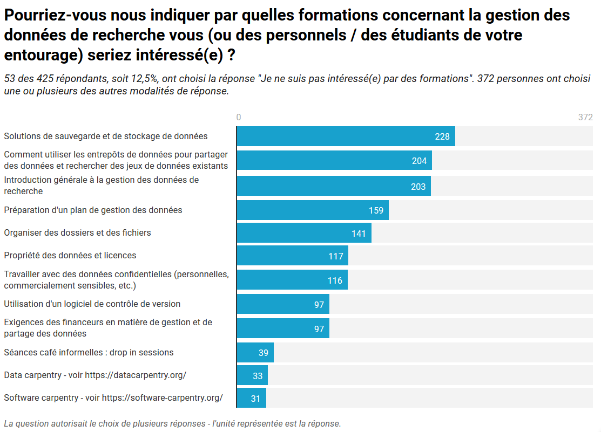

---

# 3.4 Attentes en termes de services : en détails

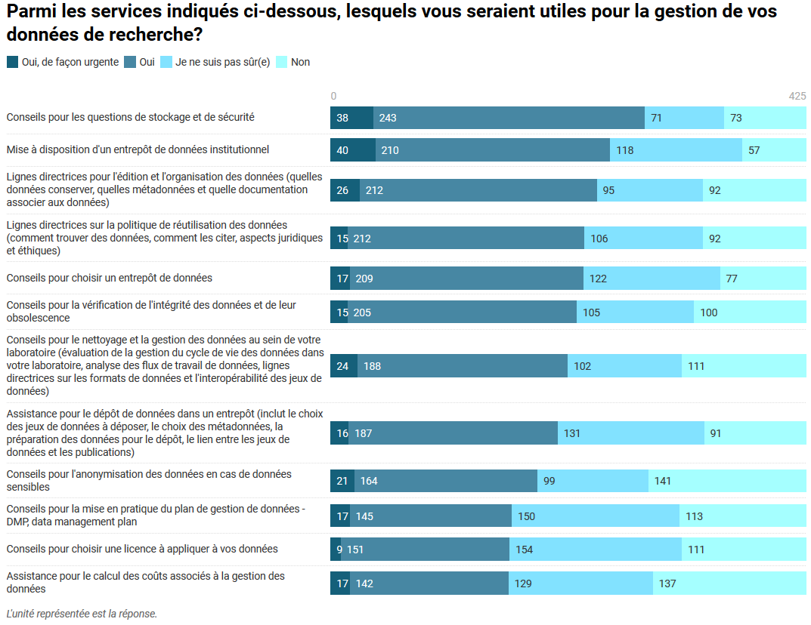

---

# Liens - 1/2

[Le projet sur Open Science Framework : Quantitative assessment of research data management practice](https://osf.io/mz3fx/)

## Enquête à l'EPFL

EPFL Library. (2018). _Research Data Management Survey Results_. https://www.epfl.ch/campus/library/wp-content/uploads/2018/09/AbreviatedReportRDSurvey_ENG_20180409_Final.pdf

---
# Liens - 2/2

## Enquête à TU Delft

* Tableau public : [données 2017-2018](https://public.tableau.com/profile/jasper.van.dijck#!/vizhome/20180809TUDelftResearchDataManagementSurvey2017-2018/TUDelftRDMsurvey2017-2018), [données 2019](https://public.tableau.com/profile/nicolas.dintzner#!/vizhome/RDMSurvey2019/Dashboard1?publish=yes)
* Billets sur le blog "Open Working" de TU Delft : [enquête 2017-2018](https://openworking.wordpress.com/2018/02/07/do-as-you-preach-results-of-2017-data-management-survey-now-published/), [enquête 2019](https://openworking.wordpress.com/2019/12/02/research-data-management-survey-2019-the-results-are-here/)
* Article concernant l'édition 2017-2018 de l'enquête

Mancilla, H. A., Teperek, M., Dijck, J. van, Heijer, K. den, Eggermont, R., Plomp, E., Velden, Y. T. der, & Kurapati, S. (2019). On a Quest for Cultural Change—Surveying Research Data Management Practices at Delft University of Technology. _LIBER Quarterly_, _29_(1), 1‑27. https://doi.org/10/ggdvxh

---
# Crédits

 

  
Ce document est mis à disposition selon les termes de la [Licence Creative Commons Attribution - Partage dans les Mêmes Conditions 3.0 France](http://creativecommons.org/licenses/by-sa/3.0/fr/)

 

**Auteur**

Frédérique Flamerie

 [orcid.org/0000-0001-6014-0134](https://orcid.org/0000-0001-6014-0134)

